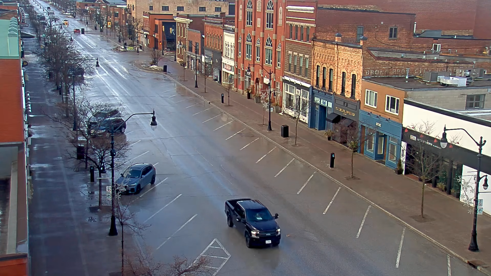
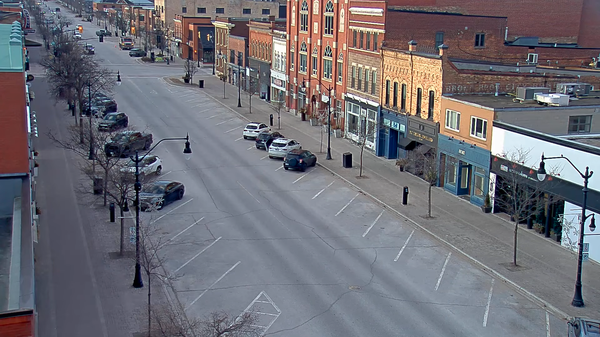

# AI Car Parking

A real-time parking occupancy detection system using YOLOv8 and OpenCV.

## Overview

This project detects vehicles from a video stream and determines whether predefined parking slots are available or occupied. Parking areas are defined as polygon regions, then vehicle and parking-slot overlap is used for occupancy classification.

## Features

- Real-time vehicle detection with YOLOv8
- Parking-slot definition using polygon coordinates
- Occupied and available slot visualization
- Support for video-stream input
- GPU availability check for model inference

## Tech Stack

- Python
- YOLOv8
- OpenCV
- NumPy

## Project Structure

```text
AiCarParking/
├── src/
│   ├── demo01.py
│   ├── demo02.py
│   ├── detect_car.py
│   └── detect_parking.py
├── slots/
│   └── slots.json
├── tools/
│   ├── draw_slots.py
│   ├── frame_parking.png
│   └── frame_parking02.png
├── check_cam.py
└── testGPU.py
```

## Getting Started

Clone the repository:

```bash
git clone https://github.com/keenzachanathip-bit/AiCarParking.git
cd AiCarParking
```

Create and activate a virtual environment:

```bash
python -m venv venv
venv\Scripts\activate
```

Install dependencies:

```bash
pip install ultralytics opencv-python numpy
```

## Usage

1. Define parking-slot polygons and save them in `slots/slots.json`.
2. Configure the video source in the detection script.
3. Run the project:

```bash
python src/demo02.py
```

## Sample Parking Areas





## Author

Chanathip Thipkongrast